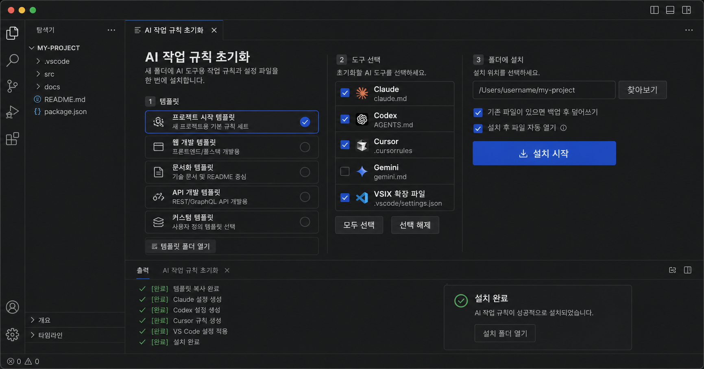
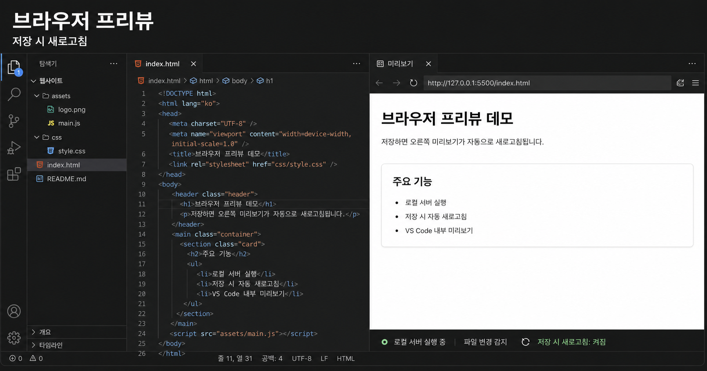
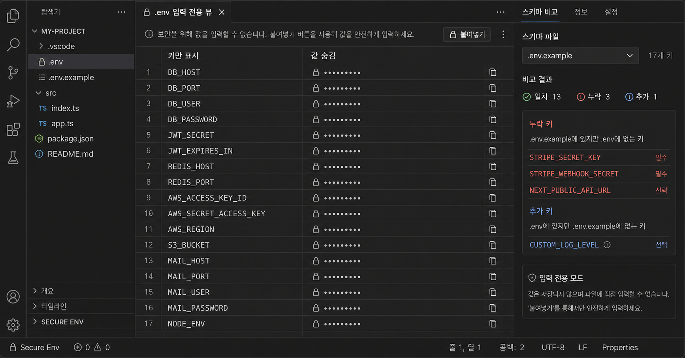
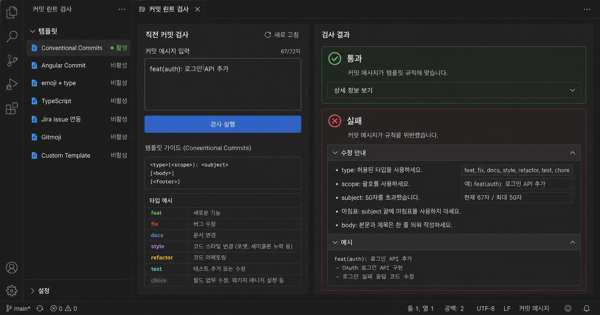
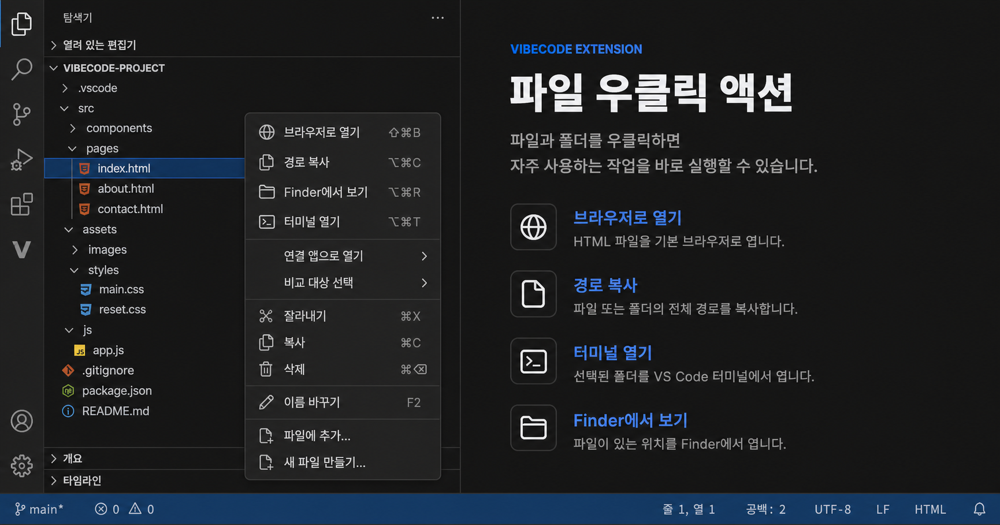
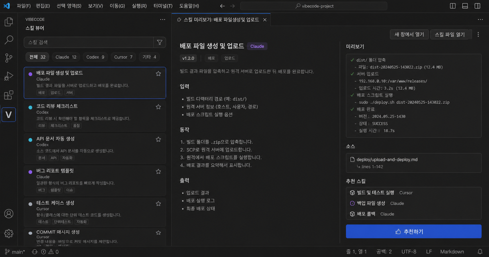

# Vibecode

[한국어](README.ko.md)

Vibecode is a set of VSCode extensions that turns repeated developer chores into right-click actions, sidebars, and focused in-editor tools. It covers AI tool setup, HTML preview, secure `.env` editing, commit checks, file actions, MCP visibility, and agent skill management.

## Why Vibecode

Developers repeat the same small tasks all day: opening folders, copying paths, running shell scripts, previewing HTML output, hiding `.env` values, checking commit messages, and keeping AI agent instruction files in sync.

Vibecode keeps those workflows inside VSCode. It is not one large application. It is a collection of focused extensions you can install and combine as needed.

## Product Assets

Each extension includes a selling thumbnail and a product positioning brief.

```text
vibecode-*/selling-thumbnail.png
vibecode-*/product_v2.md
```

## Highlights

### Standardize AI Coding Setup

Install instruction files for Claude, Codex, Cursor, Gemini, and related AI coding tools from reusable templates.

- Pick a template
- Pick target tools
- Choose the destination folder
- Generate `.claude/`, `AGENTS.md`, `.cursorrules`, `.gemini/`, `.codex/`

[Product brief](vibecode-ai-md-system-init-this-folder/product_v2.md)



### Preview HTML Inside VSCode

Open an HTML file and preview it directly inside VSCode. Saves trigger an automatic reload.

- Managed local HTTP server
- Workspace save detection
- Edit source and open in external browser
- Pro edition adds inspector, notes, device presets, and snapshot export

[Browser Preview brief](vibecode-browser-preview/product_v2.md)  
[Browser Preview Pro brief](vibecode-browser-preview-pro/product_v2.md)



### Edit `.env` Without Revealing Secrets

Show `.env` keys while keeping values off screen. The encrypted variant stores ciphertext on disk.

- Paste-only input
- Fixed masking that does not reveal value length
- Schema comparison against `.env.example`
- dotenvx-compatible encrypted writes

[Import-Only brief](vibecode-env-viewer-normal-import-only/product_v2.md)  
[Encrypted brief](vibecode-env-viewer-encryption-import-only/product_v2.md)



### Check Commits and Refactor Targets

Lint commit messages and surface oversized files before they become maintenance problems.

- Conventional Commits checks
- Node, PHP/Laravel, and Python templates
- Last-commit validation
- Workspace file ranking by line count

[Commit Lint brief](vibecode-commit-lint-check/product_v2.md)  
[File Lines brief](vibecode-show-file-lines/product_v2.md)



### Right-Click Productivity Actions

Add practical file and folder actions to the VSCode context menu.

- Open in browser
- Reveal in Finder or Explorer
- Copy absolute path
- Open terminal here
- Run `.sh` scripts
- Package and install a VSCode extension folder as `.vsix`

[File Actions brief](vibecode-right-click-action-open-to-file/product_v2.md)  
[Shell Actions brief](vibecode-right-click-sh-actions/product_v2.md)  
[VSIX Package brief](vibecode-right-click-vscode-extension-vsix-packege-and-install/product_v2.md)



### See Extensions, Skills, and MCP Servers in One Place

Browse Vibecode commands, AI agent skills, and MCP server definitions from a single VSCode workspace.

- Card launcher for installed `vibecode-*` extension commands
- Unified skill browser for Claude, Codex, Cursor, Windsurf, and Cline
- Instruction-file sync
- MCP server list grouped by User, Workspace, and Extension sources

[Extension Menu brief](vibecode-extension-menu-list/product_v2.md)  
[Skills Viewer brief](vibecode-skills-viewer/product_v2.md)  
[MCP List brief](vibecode-vscode-extension-host-mcp-list/product_v2.md)



## Extension Catalog

| Extension | Purpose |
|---|---|
| [vibecode-ai-md-system-init-this-folder](vibecode-ai-md-system-init-this-folder/) | Install AI tool instruction-file templates |
| [vibecode-browser-preview](vibecode-browser-preview/) | Live HTML preview |
| [vibecode-browser-preview-pro](vibecode-browser-preview-pro/) | Pro preview with inspector and snapshot handoff |
| [vibecode-env-viewer-normal-import-only](vibecode-env-viewer-normal-import-only/) | `.env` editing without value exposure |
| [vibecode-env-viewer-encryption-import-only](vibecode-env-viewer-encryption-import-only/) | `.env` editing with encrypted writes |
| [vibecode-commit-lint-check](vibecode-commit-lint-check/) | Commit message checks and template scaffolding |
| [vibecode-file-lint-check](vibecode-file-lint-check/) | Sidebar lint runner — ESLint, Prettier, TypeScript, JSON checks |
| [vibecode-show-file-lines](vibecode-show-file-lines/) | Find refactor targets by line count |
| [vibecode-right-click-action-open-to-file](vibecode-right-click-action-open-to-file/) | File and folder context-menu actions |
| [vibecode-right-click-sh-actions](vibecode-right-click-sh-actions/) | Run `.sh` scripts from VSCode |
| [vibecode-right-click-vscode-extension-vsix-packege-and-install](vibecode-right-click-vscode-extension-vsix-packege-and-install/) | Package and install VSIX files |
| [vibecode-extension-menu-list](vibecode-extension-menu-list/) | Launcher for Vibecode commands |
| [vibecode-skills-viewer](vibecode-skills-viewer/) | Unified AI agent skill viewer |
| [vibecode-vscode-extension-host-mcp-list](vibecode-vscode-extension-host-mcp-list/) | VSCode MCP server list |
| [vibecode-md-file-browser](vibecode-md-file-browser/) | Explorer-side Markdown tree with preview / source open |
| [vibecode-image-viewer](vibecode-image-viewer/) | Image custom editor with EXIF metadata, camera summary, and GPS-to-Google-Maps |
| [vibecode-default-editor-manager](vibecode-default-editor-manager/) | Sidebar manager for `workbench.editorAssociations` — installed custom editors, current mappings, add/remove with scope picker |
| [packages/vibecode-core](packages/vibecode-core/) | Shared `.env` crypto strategy core |

## Build and Package

Each extension is an independent VSCode extension folder.

```bash
cd <extension>
npm install
npm run build
npm run package
```

Install locally:

```bash
code --install-extension <extension>-<version>.vsix --force
```

## Marketing Material

Each `product_v2.md` contains the selling message and thumbnail direction for an extension. Each `selling-thumbnail.png` is a raster thumbnail that can be used in marketplace pages, release notes, and product overview pages.

